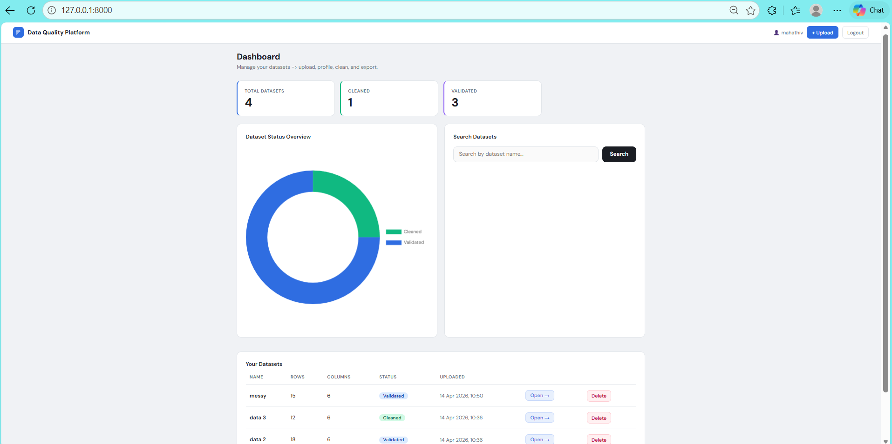
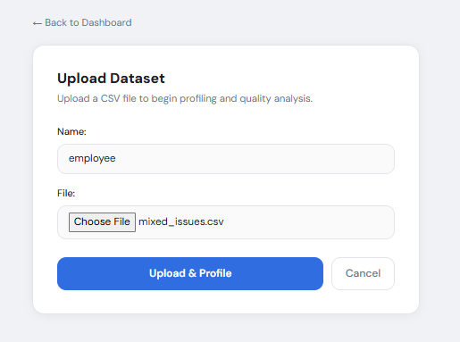
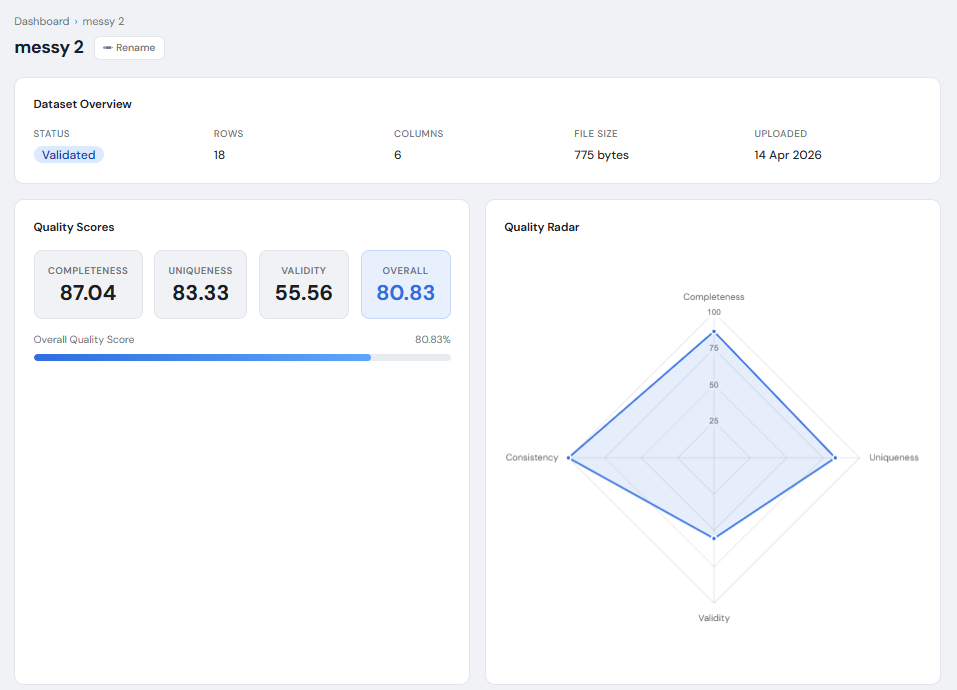
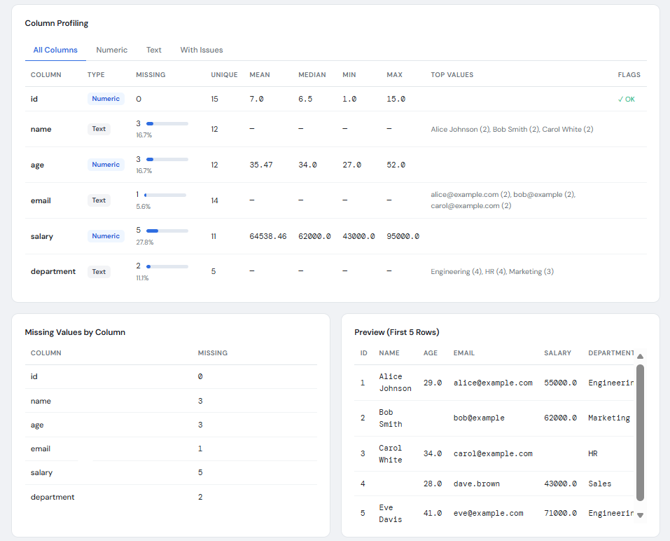
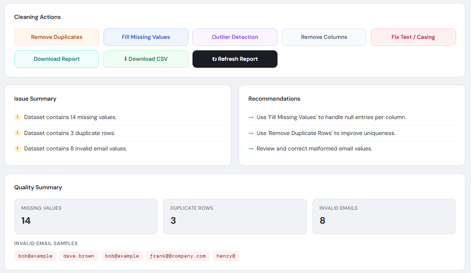
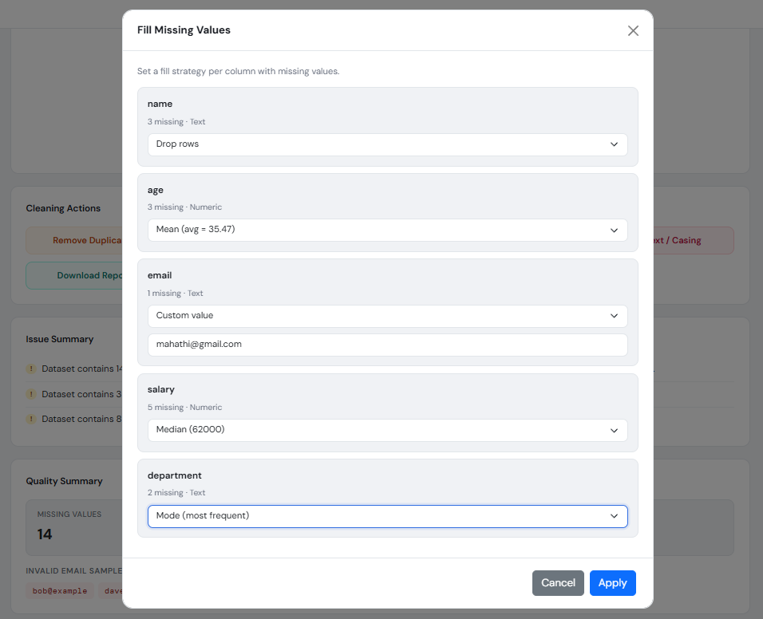
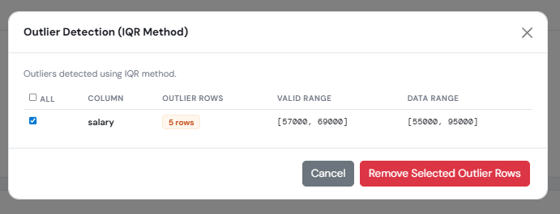
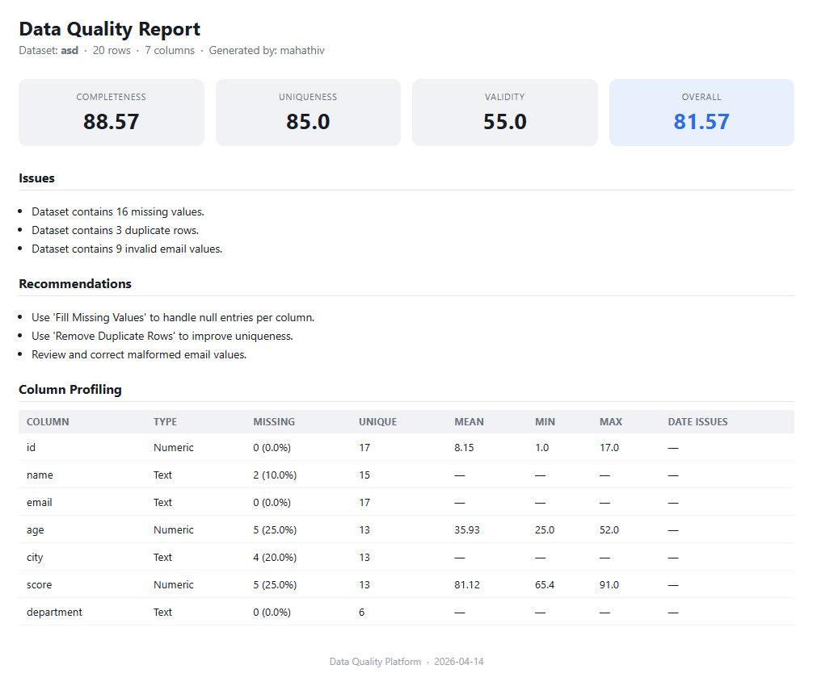
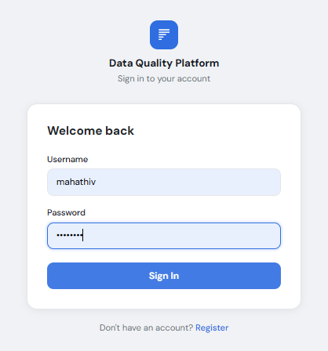

# Data Quality Intelligence Platform

A full-stack Django web application that automates dataset quality analysis, issue detection, quality scoring, and assisted cleaning. Users upload CSV files and instantly receive structured insights with actionable recommendations for data improvement.

Instead of manually inspecting messy datasets, users can upload a CSV and get instant quality scores, issue summaries, and step-by-step cleaning guidance—all in one integrated platform.

---

## The Problem

Real-world datasets are notoriously messy:
- **Missing values** reduce statistical power and model accuracy
- **Duplicate records** skew analysis results and inflate metrics
- **Invalid formats** (malformed emails, inconsistent dates) cause processing failures
- **Type mismatches** break downstream pipelines
- **Inconsistent values** (mixed case, extra whitespace) prevent joins
- **Outliers** can distort trends and predictions

Manual data cleaning is tedious, error-prone, and scales poorly—teams spend 60-80% of project time preparing data instead of deriving insights.

This platform automates **data quality assessment and assisted cleaning**, turning hours of manual work into seconds of automated analysis.

---

## Features

- **CSV Dataset Management** — Upload, store, and organize multiple datasets with automatic profiling
- **Dataset Profiling** — Extract rows, columns, data types, and memory footprint on upload
- **Missing Value Detection** — Column-wise null analysis with visualization
- **Duplicate Row Detection** — Identify and count duplicate records
- **Invalid Email Validation** — Regex-based email format checking with sample display
- **Data Type Analysis** — Detect type mismatches, numeric anomalies, and date parsing issues
- **Comprehensive Quality Scoring:**
  - **Completeness** (30% weight) — % of non-null values
  - **Uniqueness** (25% weight) — % of non-duplicate rows
  - **Validity** (25% weight) — % of correctly formatted values (email validation)
  - **Consistency** (20% weight) — Baseline metric for data uniformity
  - **Overall Score** — Weighted aggregate of all dimensions
- **Issue Summary & Recommendations** — AI-generated actionable next steps
- **Assisted Data Cleaning:**
  - Remove duplicate rows with one click
  - Fill missing values (mean, median, mode, or custom values per column)
  - Remove problematic columns
  - Detect and remove statistical outliers (IQR method)
  - Normalize text (trim, case conversion)
- **Export Cleaned Dataset** — Download improved CSV immediately
- **User Dashboard** — Search, filter, and manage datasets with status tracking
- **REST API** — Programmatic access to validation reports
- **AJAX-Based UI** — Dynamic updates without page reloads
- **Role-Based Access** — Users only see their own datasets
- **Django Admin Panel** — Monitor all reports and datasets
- **HTML Quality Report Export** — Styled standalone HTML report generation

---

## Architecture

```
User → Django Web App (MVT) → Pandas Processing → MySQL Database → REST API → jQuery AJAX UI
```

**Data Flow:**
1. User uploads CSV → Django stores file + extracts metadata
2. Pandas loads and profiles dataset → computes quality metrics
3. Validation report saved to database with detailed issue summary
4. Frontend displays interactive dashboard with real-time cleaning options
5. User selects cleaning operations → AJAX calls backend
6. Backend processes data → overwrites file + updates database
7. User exports cleaned CSV or HTML report

---

## Tech Stack

| Layer | Technology | Purpose |
|-------|-----------|---------|
| **Backend** | Django 5.2, Python 3.x | MVT framework, request handling, business logic |
| **Database** | MySQL | Persistent storage of datasets, reports, users |
| **Data Processing** | Pandas, NumPy | CSV parsing, profiling, statistical analysis, cleaning |
| **API** | Django REST Framework | JSON endpoints for report access |
| **Frontend** | Jinja2 Templates, HTML5, CSS3 | Dynamic template rendering, responsive UI |
| **Client-Side** | JavaScript, jQuery | AJAX requests, dynamic form handling, UI interactions |
| **Authentication** | Django Auth, Sessions | User login, signup, permission enforcement |
| **File Storage** | Local FileField | CSV file persistence on disk |

---

## Where Each Library Is Used

| Library | Module | Purpose |
|---------|--------|---------|
| `pandas` | `datasets/views.py` | Read CSV, compute quality metrics, apply cleaning operations |
| `numpy` | `datasets/views.py` | Statistical calculations (mean, median, std, quantiles) |
| `django.contrib.auth` | `datasets/views.py`, `data_quality_platform/urls.py` | User registration, login, session management |
| `rest_framework` | `api/views.py`, `api/urls.py` | JSON API endpoint for report retrieval |
| `django.forms` | `datasets/forms.py` | File upload validation and handling |
| `json` | `datasets/views.py` | Serialize/deserialize report data, AJAX payloads |
| `re` (regex) | `datasets/views.py` | Email format validation, date pattern detection |
| `django.template` | `templates/` | Server-side HTML rendering with Jinja2 |
| `jquery` | `templates/datasets/detail.html` | AJAX calls, DOM manipulation, form submission |
| `django.db.models` | `datasets/models.py` | ORM models (Dataset, ValidationReport) |
| `mysqlclient` | `data_quality_platform/settings.py` | MySQL driver for Django ORM |

---

## Screenshots

### Dashboard - Dataset Overview

> The main dashboard shows all uploaded datasets with quick stats: total datasets (3), cleaned (1), validated (1), profiled (1). Users can search by name or click to view details.

### Dataset Upload

> Clean file upload form with drag-and-drop support. Upon upload, the platform automatically parses the CSV, counts rows/columns, and redirects to the detail view.

### Quality Analysis Dashboard

> Real-time quality scoring for an uploaded dataset. Visual score cards display Completeness (85%), Uniqueness (92%), Validity (88%), and Overall Score (88.6%). Below: Issue summary and recommendations.

### Dataset Profiling

> Detailed per-column analysis including data type, missing count, unique values, mean/median/std (numeric), top values (categorical), and date parsing issues. Interactive table with sorting.

### Data Cleaning Operations

> Users select from multiple cleaning operations: Remove Duplicates, Fill Missing Values, Remove Outliers, Normalize Text, Remove Columns. Each operation is AJAX-powered with real-time feedback.

### Missing Value Imputation

> Column-by-column missing value strategy selection. Options: Mean (numeric), Median (numeric), Mode (categorical), Custom Value, or Drop Row. Preview of affected data before confirmation.

### Outlier Detection & Removal

> IQR-based outlier detection results showing count, lower/upper bounds, and min/max values per numeric column. Users select columns to remove outliers from.

### Quality Report (HTML Export)

> Professional HTML report with quality scorecard, issue summary, recommendations, and detailed column profiling table. Downloadable as standalone file.

### User Authentication

> Simple login form with username/password. Registration link for new users. Session-based authentication with redirect to dashboard on success.

---

## Data Quality Scoring Methodology

The platform combines four complementary quality dimensions into a single **Overall Score**:

```
Overall Score = (Completeness × 0.30) + (Uniqueness × 0.25) + (Validity × 0.25) + (Consistency × 0.20)
```

### Scoring Dimensions

| Dimension | Formula | Range | Interpretation |
|-----------|---------|-------|-----------------|
| **Completeness** | `100 - (missing_cells / total_cells) × 100` | 0–100 | % of non-null data |
| **Uniqueness** | `100 - (duplicate_rows / total_rows) × 100` | 0–100 | % of non-duplicate records |
| **Validity** | `100 - (invalid_emails / total_rows) × 100` | 0–100 | % of correctly formatted values |
| **Consistency** | `100` (baseline) | 100 | Placeholder for future enhancement |

### Example

**Dataset:** 1000 rows, 10 columns = 10,000 cells
- Missing values: 150 cells → Completeness = 100 - (150/10000)×100 = **98.5%**
- Duplicate rows: 20 → Uniqueness = 100 - (20/1000)×100 = **98%**
- Invalid emails: 5 → Validity = 100 - (5/1000)×100 = **99.5%**
- Consistency: 100 (default)

**Overall Score** = (98.5 × 0.30) + (98 × 0.25) + (99.5 × 0.25) + (100 × 0.20) = **98.7**

---

## Data Cleaning Operations

### 1. Remove Duplicates
**Algorithm:** Pandas `drop_duplicates()`
- Identifies rows that are 100% identical across all columns
- Removes all duplicates, keeping the first occurrence
- **Use case:** Deduplicating customer lists, removing test records

### 2. Fill Missing Values
**Per-column strategy selection:**
- **Numeric columns:** Mean (default), Median, Custom value
- **Categorical columns:** Mode (most frequent), Custom value
- **Any column:** Drop rows with missing values
- **Algorithm:** Pandas `fillna()` with specified method
- **Use case:** Imputing ages with mean, filling gender with mode

### 3. Remove Outliers
**Algorithm:** Interquartile Range (IQR) method
```
Q1 = 25th percentile
Q3 = 75th percentile
IQR = Q3 - Q1
Lower Bound = Q1 - 1.5 × IQR
Upper Bound = Q3 + 1.5 × IQR
Remove rows where: value < lower_bound OR value > upper_bound
```
- **Use case:** Removing salary anomalies, filtering sensor noise

### 4. Normalize Text
**Operations:**
- **Trim:** Remove leading/trailing whitespace
- **Lowercase:** Convert to lowercase
- **Uppercase:** Convert to uppercase
- **Title Case:** Capitalize first letter of each word
- **Algorithm:** Pandas string methods (`.str.strip()`, `.str.lower()`, etc.)
- **Use case:** Standardizing names, normalizing addresses

### 5. Remove Columns
**Algorithm:** Select columns for deletion → `drop(columns=list)`
- **Use case:** Removing redundant IDs, dropping test columns

---

## Setup

### Prerequisites

- **Python 3.8+**
- **MySQL Server 5.7+** (local or remote)
- **pip** (Python package manager)
- **Git**

### Installation Steps

```bash
# 1. Clone the repository
git clone https://github.com/MahathiVarikuti/Data-Quality-Intelligence-Platform-project.git
cd Data-Quality-Intelligence-Platform-project

# 2. Create virtual environment
python -m venv venv
source venv/bin/activate          # Mac/Linux
venv\Scripts\activate             # Windows

# 3. Install dependencies
pip install -r requirements.txt

# 4. Configure MySQL database (settings.py)
# Update data_quality_platform/settings.py with your MySQL credentials:
DATABASES = {
    'default': {
        'ENGINE': 'django.db.backends.mysql',
        'NAME': 'data_quality_db',          # Your database name
        'USER': 'root',                      # MySQL user
        'PASSWORD': 'root',                  # MySQL password
        'HOST': 'localhost',
        'PORT': '3306',
    }
}

# 5. Create MySQL database
mysql -u root -p
CREATE DATABASE data_quality_db;
EXIT;

# 6. Run migrations
python manage.py makemigrations
python manage.py migrate

# 7. Create superuser (admin)
python manage.py createsuperuser

# 8. Collect static files
python manage.py collectstatic --noinput

# 9. Run development server
python manage.py runserver
# Visit http://127.0.0.1:8000/
```

### Environment Configuration

No `.env` file is required; configure in `data_quality_platform/settings.py`:

```python
# SECRET_KEY - Change for production
SECRET_KEY = 'your-secret-key-here'

# DEBUG - Set to False in production
DEBUG = True

# ALLOWED_HOSTS - Add your domain
ALLOWED_HOSTS = ['*']  # or ['yourdomain.com']

# Database
DATABASES = {
    'default': {
        'ENGINE': 'django.db.backends.mysql',
        'NAME': 'data_quality_db',
        'USER': 'your_mysql_user',
        'PASSWORD': 'your_mysql_password',
        'HOST': 'localhost',
        'PORT': '3306',
    }
}

# Time zone
TIME_ZONE = 'Asia/Kolkata'  # Change as needed
```

---

## Project Structure

```
Data-Quality-Intelligence-Platform-project/
├── manage.py                           # Django management script
├── requirements.txt                    # Python dependencies
├── README.md                           # This file
├── data_quality_platform/              # Main project settings
│   ├── __init__.py
│   ├── settings.py                    # Django configuration
│   ├── urls.py                        # URL routing
│   ├── wsgi.py                        # WSGI application
│   └── asgi.py                        # ASGI application
├── datasets/                           # Main app for dataset management
│   ├── models.py                      # Dataset, ValidationReport ORM models
│   ├── views.py                       # Core business logic (23KB)
│   ├── urls.py                        # Dataset URL patterns
│   ├── forms.py                       # DatasetUploadForm
│   ├── admin.py                       # Django admin configuration
│   └── migrations/                    # Database schema migrations
├── accounts/                           # User authentication app
│   ├── models.py
│   ├── views.py
│   ├── urls.py
│   └── admin.py
├── reports/                            # Reports app (placeholder for future)
│   ├── models.py
│   ├── views.py
│   └── admin.py
├── api/                                # REST API app
│   ├── views.py                       # Report API endpoint
│   ├── urls.py                        # /api/report/<dataset_id>/
│   └── admin.py
├── templates/                          # Jinja2 HTML templates
│   ├── datasets/
│   │   ├── home.html                 # Dashboard
│   │   ├── upload.html               # Upload form
│   │   └── detail.html               # Detail + cleaning UI (37KB)
│   └── registration/
│       ├── login.html                # Login form
│       └── register.html             # Registration form
├── static/                            # CSS, JavaScript, images
│   └── [future: CSS and JS files]
└── media/                             # User-uploaded datasets (gitignored)
    └── datasets/

```

---

## API Documentation

### GET /api/report/<dataset_id>/

**Description:** Retrieve validation report for a dataset as JSON.

**Method:** GET

**Authentication:** Not required (AllowAny)

**Parameters:**
- `dataset_id` (int, required) — ID of the dataset

**Response (200 OK):**
```json
{
  "dataset_id": 1,
  "dataset_name": "customer_data.csv",
  "status": "validated",
  "num_rows": 1000,
  "num_columns": 10,
  "completeness_score": 98.5,
  "uniqueness_score": 98.0,
  "validity_score": 99.5,
  "consistency_score": 100.0,
  "overall_score": 98.7,
  "total_missing": 15,
  "duplicate_count": 2,
  "invalid_email_count": 5,
  "issue_summary": [
    "Dataset contains 15 missing values.",
    "Dataset contains 2 duplicate rows."
  ],
  "recommendations": [
    "Use 'Fill Missing Values' to handle null entries per column.",
    "Use 'Remove Duplicate Rows' to improve uniqueness."
  ]
}
```

**Error Responses:**
- `404 Not Found` — Dataset or report does not exist

**Example cURL:**
```bash
curl -X GET http://localhost:8000/api/report/1/
```

---

## Core Views & Endpoints

| Endpoint | Method | Purpose |
|----------|--------|---------|
| `/` | GET | Home dashboard (list all user datasets) |
| `/datasets/upload/` | GET, POST | Upload new dataset |
| `/datasets/<id>/` | GET | View dataset details & quality report |
| `/datasets/<id>/remove-duplicates/` | POST | Remove duplicate rows (AJAX) |
| `/datasets/<id>/fill-missing-values/` | POST | Fill missing values with strategy (AJAX) |
| `/datasets/<id>/remove-columns/` | POST | Delete selected columns (AJAX) |
| `/datasets/<id>/detect-outliers/` | GET | Detect outliers (AJAX) |
| `/datasets/<id>/remove-outliers/` | POST | Remove outliers per column (AJAX) |
| `/datasets/<id>/fix-text/` | POST | Normalize text columns (AJAX) |
| `/datasets/<id>/quality-report/` | GET | Download HTML quality report |
| `/datasets/<id>/export/` | GET | Download cleaned CSV file |
| `/datasets/<id>/update-name/` | POST | Rename dataset (AJAX) |
| `/datasets/<id>/delete/` | POST | Delete dataset and file (AJAX) |
| `/api/report/<id>/` | GET | JSON report API |
| `/login/` | GET, POST | User login |
| `/register/` | GET, POST | User registration |
| `/logout/` | GET | User logout |

---

## Database Schema

### Dataset Model
```python
class Dataset(models.Model):
    user = ForeignKey(User)              # Dataset owner
    name = CharField(max_length=255)     # Display name
    file = FileField(upload_to='datasets/')  # CSV file
    uploaded_at = DateTimeField(auto_now_add=True)
    file_size = BigIntegerField()        # Bytes
    num_rows = IntegerField()            # Row count
    num_columns = IntegerField()         # Column count
    status = CharField(choices=[          # Processing status
        ('uploaded', 'Uploaded'),
        ('profiled', 'Profiled'),
        ('validated', 'Validated'),
        ('cleaned', 'Cleaned'),
    ])
    initial_missing_count = IntegerField()
    initial_duplicate_count = IntegerField()
    initial_overall_score = FloatField()
```

### ValidationReport Model
```python
class ValidationReport(models.Model):
    dataset = OneToOneField(Dataset, related_name='report')
    completeness_score = FloatField()
    uniqueness_score = FloatField()
    validity_score = FloatField()
    consistency_score = FloatField()
    overall_score = FloatField()
    
    total_missing = IntegerField()       # Count
    duplicate_count = IntegerField()     # Count
    invalid_email_count = IntegerField() # Count
    invalid_type_count = IntegerField()  # Count
    
    issue_summary = JSONField()          # List of issue strings
    recommendations = JSONField()        # List of recommendation strings
    
    created_at = DateTimeField(auto_now_add=True)
    updated_at = DateTimeField(auto_now=True)
```

---

## Limitations

- **No background task processing** — Large datasets (>100MB) will block the request. Consider Celery + Redis for async processing.
- **Local file storage** — Not suitable for multi-server deployment. Use S3/GCS for cloud scaling.
- **Single-user per dataset** — No collaboration/sharing features yet.
- **Limited data type detection** — Relies on Pandas inference; complex types (JSON, nested) not supported.
- **Email validation only** — No other regex patterns for phone, URL, date validation by default.
- **Consistency metric is static** — Future: add pattern matching, referential integrity checks.
- **No data versioning** — Cleaning operations overwrite the file; no rollback capability.
- **Session-based auth only** — No API tokens or OAuth for programmatic access (yet).

---

## Future Work

- **Async Processing** — Celery + Redis for background dataset processing
- **Cloud Storage** — AWS S3, Google Cloud Storage, Azure Blob integration
- **Advanced Pattern Detection** — Phone numbers, URLs, postal codes, custom regex
- **Data Lineage Tracking** — Track cleaning operations and revert to previous versions
- **Collaboration Features** — Share datasets, invite team members with roles
- **Data Profiling Reports** — Visual charts, histograms, correlation matrices
- **Machine Learning Insights** — Anomaly detection, predictive quality scoring
- **Schema Validation** — Upload data dictionaries, validate against schema
- **Real-time Previews** — Live preview of cleaning operations before applying
- **Bulk Operations** — Process multiple datasets in parallel
- **Data Masking** — PII redaction for sensitive datasets
- **API Tokens** — Token-based authentication for programmatic access
- **Audit Logs** — Track all user actions and data modifications
- **Custom Metrics** — Allow users to define domain-specific quality rules

---

## Author

**Mahathi Varikuti**

Built as a portfolio project demonstrating end-to-end full-stack data engineering—from data profiling and quality analysis to cleaning orchestration and report generation. The platform showcases Django backend design, pandas data processing, MySQL persistence, REST API design, and dynamic frontend interactions with jQuery AJAX.